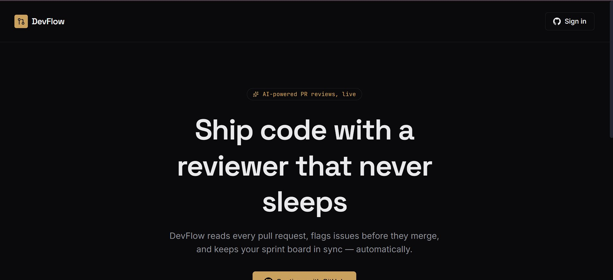
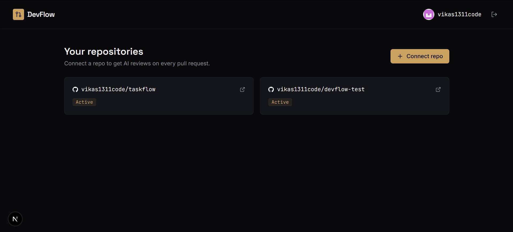
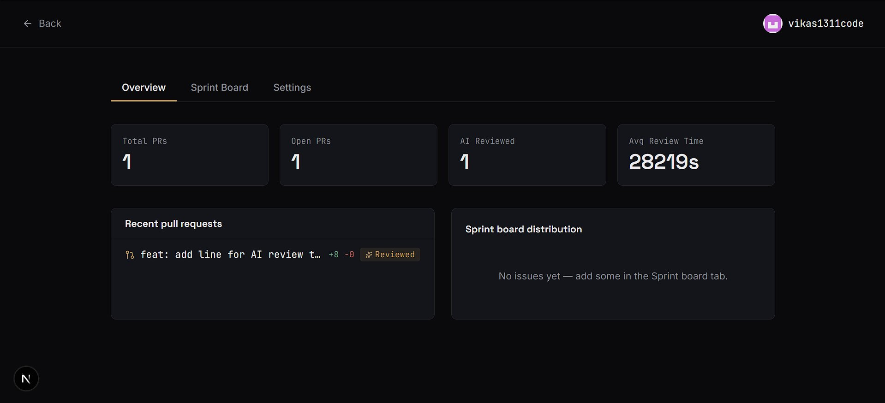
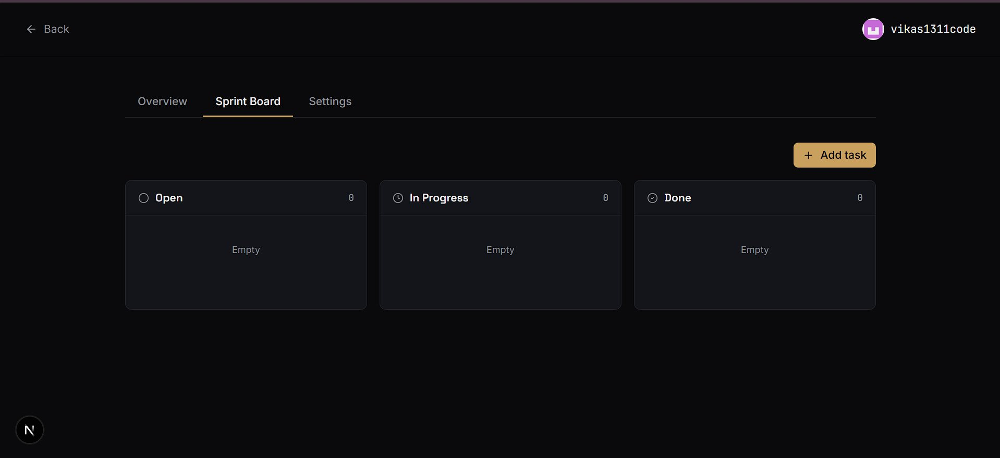
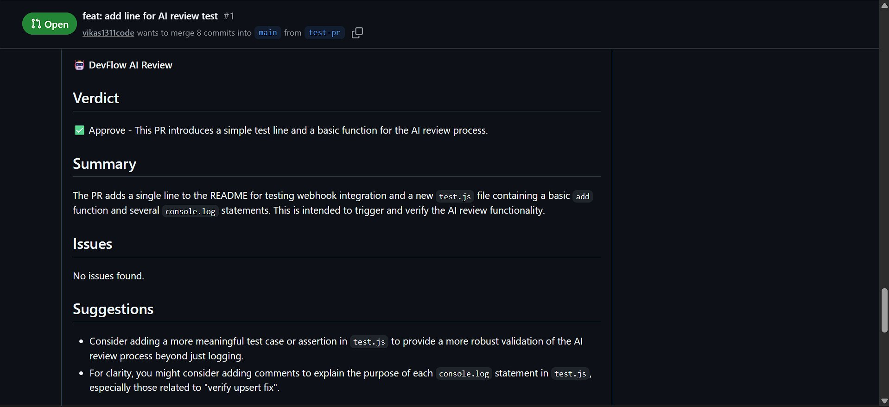
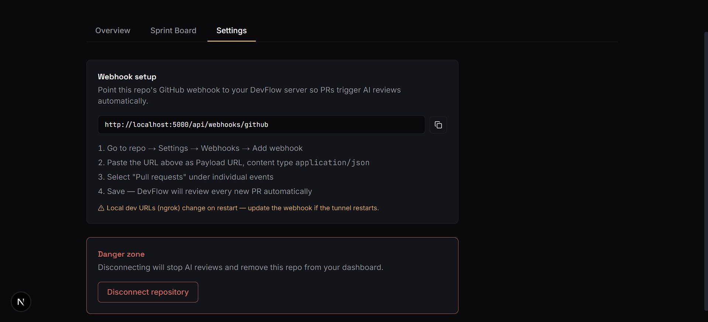

<div align="center">

# 🚀 DevFlow

### AI-powered pull request reviewer, sprint board & analytics — for developer teams who ship fast.

[](https://dev-flow-red-rho.vercel.app)
[](https://devflow-gbcj.onrender.com/health)
[](LICENSE)

[](https://nextjs.org)
[](https://expressjs.com)
[](https://postgresql.org)
[](https://ai.google.dev)
[](https://typescriptlang.org)
[](https://docker.com)

</div>

---

## What is DevFlow?

DevFlow is a self-hosted GitHub app that turns every pull request into a reviewed, tracked, and measured unit of work — automatically.

The moment a developer opens a PR, DevFlow:
1. **Reads the full diff** via the GitHub API
2. **Runs 4 parallel AI reviewers** — a main reviewer, a security specialist, a performance analyst, and a junior dev asking clarifying questions
3. **Calculates a Blast Radius risk score** — based on diff size, files touched, and historical file churn
4. **Auto-fixes Critical security issues** — pushes a patch commit directly to the PR branch
5. **Posts all reviews as PR comments** and logs everything to PostgreSQL
6. Surfaces it all on a **live dashboard** with Kanban sprint board and analytics

> 🔗 **Try it live**: [dev-flow-red-rho.vercel.app](https://dev-flow-red-rho.vercel.app)

---

## ✨ Features

| | |
|---|---|
| 🤖 **Multi-Persona AI Review** | Every PR gets 4 parallel reviews: main verdict, 🔒 Security, ⚡ Performance, and 🤔 Junior Dev — posted as separate GitHub comments. |
| 🎯 **Blast Radius & Risk Score** | Each PR gets a 0-100 risk score based on diff size, file count, and file churn history. Hot files flagged automatically. |
| 🔧 **Auto-Fix Engine** | When a Critical security issue is detected, DevFlow pushes an AI-generated fix commit directly to the PR branch. |
| 🔐 **GitHub OAuth + JWT** | Secure login, access + refresh tokens, role-based access control middleware. |
| ⚡ **Real-time Webhooks** | GitHub PR events ingested instantly via webhooks — entire pipeline completes in seconds. |
| 📋 **Sprint Board** | Drag-free Kanban (Open → In Progress → Done) scoped per repository. |
| 📊 **Analytics Dashboard** | PR throughput, AI review coverage, risk scores, diff trends — via Recharts. |
| 🛡️ **Hardened API** | Helmet, rate limiting, CORS, parameterized queries, upsert-safe webhook handling. |

---

## 📸 Screenshots

<table>
<tr>
<td width="50%">

**Landing**


</td>
<td width="50%">

**Dashboard**


</td>
</tr>
<tr>
<td width="50%">

**Analytics Overview**


</td>
<td width="50%">

**Sprint Board**


</td>
</tr>
<tr>
<td width="50%">

**AI Review on GitHub**


</td>
<td width="50%">

**Webhook Settings**


</td>
</tr>
</table>

---

## 🧠 How the AI review pipeline works

1. Developer pushes a commit to an open PR
2. **GitHub Webhook** fires → hits DevFlow's Express API (hosted on Render)
3. DevFlow fetches the **full diff** via the GitHub REST API
4. **Risk score** calculated from diff size, files touched, and historical churn data
5. **4 parallel AI reviewers** run via Gemini API:
   - Main reviewer: verdict + summary + severity-tagged issues + suggestions
   - 🔒 Security Reviewer: vulnerabilities, injection risks, secrets
   - ⚡ Performance Reviewer: N+1 queries, memory leaks, blocking ops
   - 🤔 Junior Dev: clarifying questions on confusing code
6. If a **Critical** security issue is found → Auto-Fix engine fetches the file, generates a patch, and pushes a fix commit to the PR branch
7. All reviews posted as **PR comments**, risk score and metadata upserted into PostgreSQL
8. **Next.js dashboard** reflects live analytics, sprint board, and PR history

---

## 🛠 Tech Stack

**Frontend** — Next.js 14 (App Router), TypeScript, Tailwind CSS, Recharts, Lucide Icons
**Backend** — Node.js, Express.js, PostgreSQL, JWT (access + refresh), Helmet, express-rate-limit
**AI** — Google Gemini API (multi-persona prompting, auto-fix generation)
**Integrations** — GitHub REST API, GitHub OAuth, GitHub Webhooks, GitHub Contents API
**Infra** — Render (API + Postgres), Vercel (frontend), Docker-ready

---

## 🚀 Running it locally

### Prerequisites
- Node.js 20+, PostgreSQL, ngrok
- GitHub OAuth App + fine-grained PAT (repo: contents read/write, pull requests read/write)
- Gemini API key (free — [aistudio.google.com/apikey](https://aistudio.google.com/apikey))

### Backend
```bash
cd backend
npm install
cp .env.example .env
npm run dev
```

### Frontend
```bash
cd frontend
npm install
npm run dev
```

Visit `http://localhost:3000`.

### Webhook (local dev)
```bash
ngrok http 5000
```
Add `<ngrok-url>/api/webhooks/github` as webhook payload URL, subscribed to **Pull requests**.

---

## 🗺 Roadmap

- [x] Multi-persona parallel AI reviews
- [x] Blast Radius risk scoring with file churn tracking
- [x] Auto-Fix engine for Critical security issues
- [ ] Slack/Discord notifications for review results
- [ ] Per-org team analytics and velocity tracking
- [ ] GitHub App (vs OAuth App) for org-wide installs

---

## 📝 License

MIT © [Vikas Pandey](https://github.com/vikas1311code)
